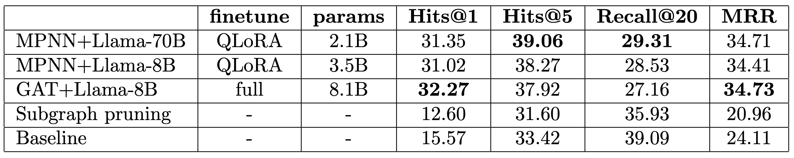

# LLM Finetuning: GraphRAG with GNN+LLM architecture on STaRK-Prime Knowledge Graph

This repo contains experiments for Knowledge Graph Retrieval (GraphRAG) with a GNN+LLM architecture for Q&A on the STaRK-Prime benchmark dataset. We use the base GNN+LLM architecture [G-Retriever](https://arxiv.org/abs/2402.07630), and [STaRK-Prime KG Q&A](https://stark.stanford.edu/dataset_prime.html) benchmark.

This work is based on [neo4j-product-examples/neo4j-gnn-llm-example](https://github.com/neo4j-product-examples/neo4j-gnn-llm-example.git). We extend these results as follows:

1. Add support for model quantization and mixed precision QLoRA using `peft` and `bitsandbytes`.
2. Enable multi-gpu training with DDP/FSDP using `accelerate`.
3. Add `bitsandbytes` 8-bit optimizers as defaults: `AdamW8Bit` or `PagedAdamW8Bit`. 
4. Introduce an MPNN architecture with edge convolution and multiple aggregations to improve encoding of textualized Knowledge Graphs in `MPNN.py`.
5. With a reduced memory footprint and improved architecture, we finetune MPNN+Llama-70B with QLoRA, which achieves competitive performance with a full finetune of GAT+Llama-8B on the STaRK-Prime Q&A benchmark.

## Architecture Overview

The G-Retriever architecture has four main parts:
1. GraphRAG retrieval for selecting the most relevant subgraph $`S^* = (V^*, E^*)`$ for a query. Subgraphs for this repo have been precomputed using Neo4j and can be downloaded with `get_precomputed_kg.py`
2. GNN/MPNN for aggregating and encoding text embeddings associated with nodes $`V^*`$ and edges $`E^*`$ of the knowledge subgraph.
3. A projection module to map the GNN/MPNN output into a set of tokens.
4. An LLM that takes the original query, context from all text in the subgraph, and graph tokens computed by the GNN/projection.

The GNN, Projection module, and LLM all have trainable parameters. For LORA/QLoRA training the base LLM parameters are frozen and only the `A`/`B` adapter matrices are trainable.

We improve the graph encoding step by replacing the GAT network with a more expressive MPNN. Our MPNN implementation uses `EdgeConv` layers[[1](https://arxiv.org/abs/1801.07829)] to consider relative distances between node embeddings in the knowledge subgraph and multiple aggregations[[2](https://arxiv.org/abs/2004.05718)] to improve expressive power, i.e.

```
MPNN(
  (conv): ModuleList(
    (0): EdgeConv(in_features=1536, out_features=2048, aggr=['sum', 'max', 'mean', 'var'])
    (1-3): 3 x EdgeConv(in_features=2048, out_features=2048, aggr=['sum', 'max', 'mean', 'var'])
  )
  (project): ModuleList(
    (0): Linear(in_features=1536, out_features=2048, bias=True)
    (1-2): 2 x Identity()
    (3): Linear(in_features=2048, out_features=2048, bias=True)
  )
)
```

Additionally, we improve the projection module by replacing the 2-layer MLP with a Transformer style FFN (with extra post LaterNorm). e.g. mapping a `dim=2048` MPNN output to a set of `8` tokens of embeddding dim `4096` for Llama-8B as:
```
Proj(
  (net): Sequential(
    (0): LayerNorm((2048,), eps=1e-05, elementwise_affine=True)
    (1): Linear(in_features=2048, out_features=2048, bias=True)
    (2): GELU(approximate='none')
    (3): Dropout(p=0.05, inplace=False)
    (4): Linear(in_features=2048, out_features=32768, bias=True)
    (5): Dropout(p=0.05, inplace=False)
    (6): Unflatten(dim=-1, unflattened_size=(8, 4096))
    (7): LayerNorm((4096,), eps=1e-05, elementwise_affine=True)
  )
)
```
which improves training stability of training and token scaling for compatibilty with text based tokens.

## Results

We finetune two QLoRA models for comparison with the original full finetune in [neo4j-product-examples/neo4j-gnn-llm-example](https://github.com/neo4j-product-examples/neo4j-gnn-llm-example.git). While full finetuning of the `GAT+Llama-8B` still achieves the best results for the for the first returned answer (i.e.,`Hits@1` and `MRR`) each of the QLoRA finetunes nearly matches this performance with a fraction of the parameters. Notably, the MPNN architecture improves performance on questions with multiple answers (i.e., `Hits@5` and `Recall@20`) by reducing oversquashing/bottlenecking of the original GAT network, and hence more relevant information from the knowledge subgraph can be used to inform answers.




## Installation

First, set up this repository: 

```
git clone https://github.com/nngabe/qlora_graphrag.git
cd qlora_graphrag/
```

Then install the necessary dependencies and datasets:

```
source setup.sh
```

To download Llama models, you will need to login to huggingface using
```
hf auth login --token YOUR_HF_TOKEN_WITH_LLAMA_ACCESS
```

Lastly, to reproduce the results of the experiments run:
```
python -u single.py --device cuda --llama_version llama3.1-8b --use_lora --use_quantization --freeze_llm --lora_rank 4096 --epochs 4 --gnn mpnn
python -u single.py --device cuda --llama_version llama3.3-70b --use_lora --use_quantization --freeze_llm --lora_rank 512 --epochs 4 --paged_adamw --gnn mpnn
```
or on multi-gpu nodes:
```
accelerate launch --config_file configs/fsdp.yaml multi.py --llama_version llama3.1-8b --use_lora --use_quantization --freeze_llm --lora_rank 4096 --lora_alpha 2048 --epochs 4 --gnn mpnn
accelerate launch --config_file configs/fsdp.yaml multi.py --llama_version llama3.3-70b --use_lora --use_quantization --freeze_llm --lora_rank 512 --lora_alpha 256 --epochs 4 --paged_adamw --gnn mpnn
```

